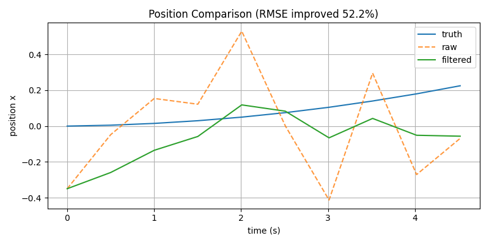
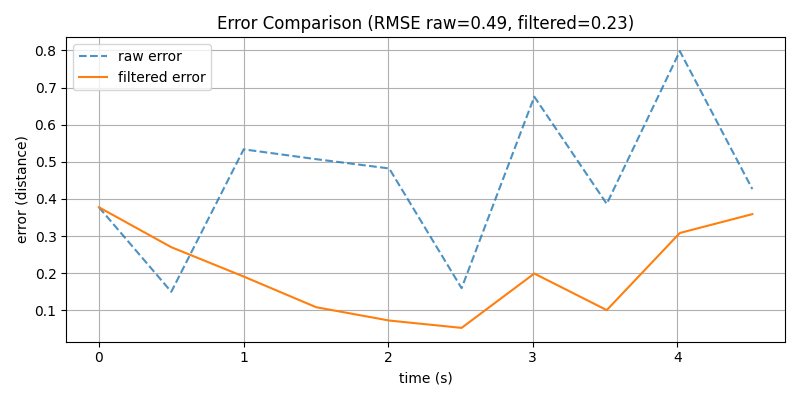
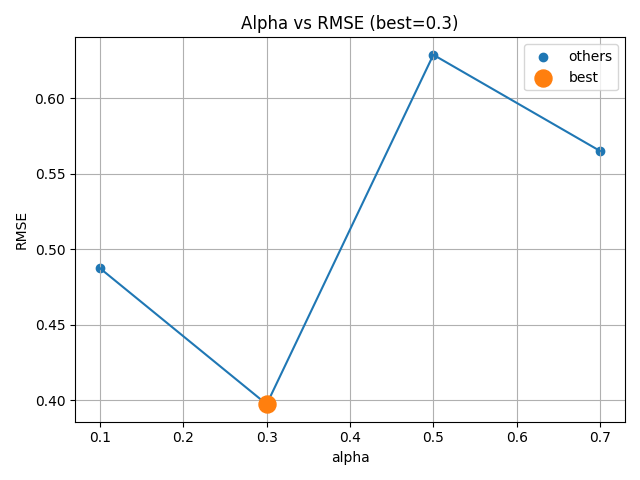
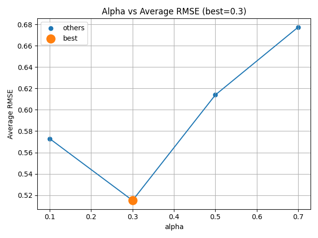

# Autonomous Sensor Pipeline (C++ × Python)

## ■ 概要

本プロジェクトは、センサデータの生成からノイズ除去・評価・可視化までを一貫して行う  
**自動運転向けセンサパイプラインの簡易シミュレーション**です。

* C++：リアルタイムデータ生成・フィルタ処理
* Python：統計分析・可視化・パラメータ評価

---

## ■ 背景 / 目的

自動運転やロボティクスでは、センサデータには必ずノイズが含まれます。  
そのため、**フィルタリングによる精度改善とその定量評価**が重要になります。

本プロジェクトでは以下を目的としました：

* ノイズ付きセンサデータのシミュレーション
* EMA（指数移動平均）によるノイズ低減
* RMSEによる精度評価
* パラメータ（alpha）の最適化

---

## ■ システム構成

```
Sensor (C++)
   ↓ raw data
Processor (C++)
   ↓ filtered data
Logger (C++)
   ↓ CSV出力
Python Scripts
   ↓ 分析・可視化
```

---

## ■ 各コンポーネント

### ① Sensor（センサシミュレータ）

* 位置・速度を物理モデルで更新
* 加速度を時間積分して位置を算出
* ノイズを加えた観測値を生成

```cpp
velocity += acceleration * dt
position += velocity * dt
```

※ 初回はdtが極小になるため微小値が出る

---

### ② Processor（フィルタ処理）

EMA（指数移動平均）を使用

```
filtered = α * current + (1 - α) * previous
```

特徴：

* αが小さい → 滑らか（遅い）
* αが大きい → 追従性高い（ノイズ残る）

---

### ③ Logger

* raw / filtered / truth をCSV出力
* Python側で解析可能に

---

## ■ 評価指標

### ① 標準偏差（ノイズ量）

* ノイズのばらつきを評価

### ② RMSE（Root Mean Square Error）

* 真値との差を評価（精度指標）

```
RMSE = sqrt(mean((pred - truth)^2))
```

---

## ■ 実験結果

### 実行例

```
=== RMSE Evaluation ===
Raw        : 0.489
Filtered   : 0.233
Improvement: 52.2%
```

👉 EMAにより約50%の精度改善を確認

---

### 位置比較（Raw vs Filtered vs Truth）
  
👉 フィルタによりノイズが抑制され、真値に近づいていることが確認できる

---

### 誤差比較（RMSEの元）
  
👉 フィルタ後は誤差が一貫して低減している

---

## ■ αパラメータの影響

### 単発評価
alphaごとにRMSEを比較  
  

---

### 平均評価（5回ずつ実行）
  
```
alpha  avg_rmse
0.1    0.57
0.3    0.52  ← best
0.5    0.61
0.7    0.68
```
👉 α=0.3付近が最適

※ 実行ごとにノイズがランダムに生成されるため、最適なα（best）は毎回多少変動する可能性があります   
※ 表示値は小数第2位で丸めています

単発評価：py_alpha_sweep  
平均評価：py_alpha_sweep_ave

---

## ■ 実装上のポイント

* dtベースの物理シミュレーション
* スレッドによる非同期パイプライン
* SafeQueueによるスレッド間通信
* ノイズモデル（正規分布）
* Pythonでの統計評価・可視化

---

## ■ 実行環境

本プロジェクトは以下の環境で動作確認しています：

* OS: Ubuntu (WSL2)
* コンパイラ: g++（C++17対応）
* Python: 3.12（venv環境）

---

## ■ 補足

* Linux環境（Ubuntu）での実行を想定しています
* Windowsの場合はWSLの使用を推奨します
* Python仮想環境（venv）の使用を推奨します

---

## ■ 実行方法（Quick Start）

### ① ビルド

```bash
mkdir build
cd build
cmake ..
make
```

---

### ② 実行（基本）

```bash
make run
```

👉 本プロジェクトの基本的な実行方法です  
👉 センサ生成 → フィルタ → 分析 → 可視化まで一括で実行されます

---

### ③ パラメータ指定実行（CMake経由）

本プロジェクトでは、実行時パラメータはCMake変数 `ARGS` を通して変更することが可能です

```bash
cmake .. -D ARGS="--duration;5;--interval;300;--noise;0.7;--alpha;0.3;--ax;0.5;--ay;0.2"
make run
```

### パラメータ一覧

| パラメータ    | 内容            | 範囲           |
| -------- | ------------- | ------------ |
| duration | シミュレーション時間（秒） | > 0          |
| interval | センサ更新間隔（ms）   | > 0          |
| noise | ノイズの強さ（標準偏差） | ≥ 0（大きすぎる値は非推奨） |
| alpha    | EMAフィルタ係数     | 0.0 ～ 1.0    |
| ax       | x方向の加速度       | -10.0 ～ 10.0 |
| ay       | y方向の加速度       | -10.0 ～ 10.0 |

※ 不正な値が入力された場合は例外を投げて終了します  
※ デフォルトパラメータは、ノイズの影響とフィルタ効果が視覚的・定量的に確認しやすい値に設定しています  
※ デフォルトパラメータから大きく異なる範囲を指定した場合、グラフが崩れる可能性があります

---

### ④ αスイープ（補助評価）

```bash
make py_alpha_sweep
```

α = [0.1, 0.3, 0.5, 0.7] で実行し、RMSEを比較します。

※ 本スクリプトではパラメータは固定値を使用しています  
※ 詳細なパラメータ調整を行いたい場合は③の方法を使用してください

---

### ⑤ αスイープ平均評価（安定性評価）

```bash
make py_alpha_sweep_ave
```
各αについて5回ずつ実行し、RMSEの平均を算出することで、より安定したRMSE評価を行います。

* 単発実行はノイズの影響を受けるため結果がばらつく  
* 複数回の平均を取ることで、より信頼性の高い最適αを評価可能

👉 パラメータ調整の最終判断に使用します

---

## ■ 使用技術

* C++17（マルチスレッド / chrono）
* Python（pandas / matplotlib / numpy）
* CMake

---

## ■ 今後の改善案

* Kalman Filterへの拡張
* センサ融合（IMU + GPS）
* ROSとの連携
* リアルタイム可視化

---

## ■ まとめ

本プロジェクトでは、

* センサノイズの再現
* フィルタによる改善
* 定量評価（RMSE）
* パラメータ最適化

までを一貫して実装しました。

👉 **「動かす」だけでなく「評価する」ことを重視した設計**となっています。
